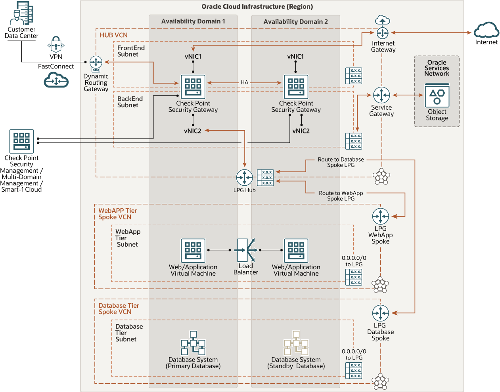

# High Availability Active/Passive - Reference Architecture

We are using hub-and-spoke architecture (often called as star topology) to achieve High Availability with Check Point CloudGuard Firewall. This architecture has a central component (the hub) that's connected to multiple networks around it, like a spoke. We are using CloudGuard BOYL Listing from OCI Marketplace.

For details of the architecture, see [_Secure Cloud Workloads using Check Point CloudGuard Firewalls_](https://docs.oracle.com/en/solutions/secure-workloads-with-check-point-cloudguard/index.html).

## Architecture Diagram



## Validated Version Details

We have validated R81-rev1.0 CloudGuard Firewall for this architecture.

## Prerequisites

You should complete below pre-requisites before proceeding to next section:
- You have an active Oracle Cloud Infrastructure Account.
  - Tenancy OCID, User OCID, Compartment OCID, Private and Public Keys are setup properly.
- Permission to `manage` the following types of resources in your Oracle Cloud Infrastructure tenancy: `vcns`, `internet-gateways`, `route-tables`, `security-lists`, `local-peering-gateways`, `subnets`, `dynamic-groups` and `instances`.
- Quota to create the following resources: 3 VCNS, 6 subnets, and 6 compute instance.

If you don't have the required permissions and quota, contact your tenancy administrator. See [Policy Reference](https://docs.cloud.oracle.com/en-us/iaas/Content/Identity/Reference/policyreference.htm), [Service Limits](https://docs.cloud.oracle.com/en-us/iaas/Content/General/Concepts/servicelimits.htm), [Compartment Quotas](https://docs.cloud.oracle.com/iaas/Content/General/Concepts/resourcequotas.htm).


## Deployment Options

You can deploy this architecture using two approach explained in each section: 
1. Using Oracle Resource Manager 
2. Using Terraform CLI 

## Deploy Using Oracle Resource Manager

In this section you will follow each steps given below to create this architecture:

1. Click [](https://console.us-phoenix-1.oraclecloud.com/resourcemanager/stacks/create?region=home&zipUrl=https://github.com/oracle-quickstart/oci-check-point/raw/master/use-cases/ha-lpg-active-passive/resource-manager/check-point-ha.zip)

    > If you aren't already signed in, when prompted, enter the tenancy and user credentials.

2. Review and accept the terms and conditions.

3. Select the region where you want to deploy the stack.

4. Follow the on-screen prompts and instructions to create the stack.

5. After creating the stack, click **Terraform Actions**, and select **Plan** from the stack on OCI console UI.

6. Wait for the job to be completed, and review the plan.

    > To make any changes, return to the Stack Details page, click **Edit Stack**, and make the required changes. Then, run the **Plan** action again.

7. If no further changes are necessary, return to the Stack Details page, click **Terraform Actions**, and select **Apply**. 

8. At this stage your architecture should have been deployed successfully. You can proceed to next section for configuring your Check Point CloudGuard Firewall.

9. If you no longer require your infrastructure, return to the Stack Details page and **Terraform Actions**, and select **Destroy**.


## Deploy Using the Terraform CLI

In this section you will use **Terraform** locally to create this architecture: 


1. Create a local copy of this repo using below command on your terminal: 

    ```
    git clone https://github.com/oracle-quickstart/oci-check-point.git
    cd oci-check-point/use-cases/ha-lpg-active-passive/
    ls
    ```

2. Complete the prerequisites described [here] which are associated to install **Terraform** locally:(https://github.com/oracle-quickstart/oci-prerequisites#install-terraform).
    Make sure you have terraform v0.13+ cli installed and accessible from your terminal.

    ```bash
    terraform -v

    Terraform v0.13.0
    + provider.oci v4.14.0
    ```

3. Create a `terraform.tfvars` file in your **check-point-ha** directory, and specify the following variables:

    ```
    # Authentication
    tenancy_ocid         = "<tenancy_ocid>"
    user_ocid            = "<user_ocid>"
    fingerprint          = "<finger_print>"
    private_key_path     = "<pem_private_key_pem_file_path>"

    # SSH Keys
    ssh_public_key  = "<public_ssh_key_string_value>"

    # Region
    region = "<oci_region>"

    # Compartment
    compute_compartment_ocid = "<compartment_ocid>"
    network_compartment_ocid = "<network_compartment_ocid>"
    availability_domain_number = "<availability_domain_number>

    ````

4. Create the Resources using the following commands:

    ```bash
    terraform init
    terraform plan
    terraform apply
    ```

5. At this stage your architecture should have been deployed successfully. You can proceed to next section for configuring your Check Point CloudGuard Firewall. 

6. If you no longer require your infrastructure, you can run this command to destroy the resources:

    ```bash
    terraform destroy
    ```

## Check Point CloudGuard Firewall Configuration

 - Update this section with Workshop link

## Feedback 

Feedbacks are welcome to this repo, please open a PR if you have any.